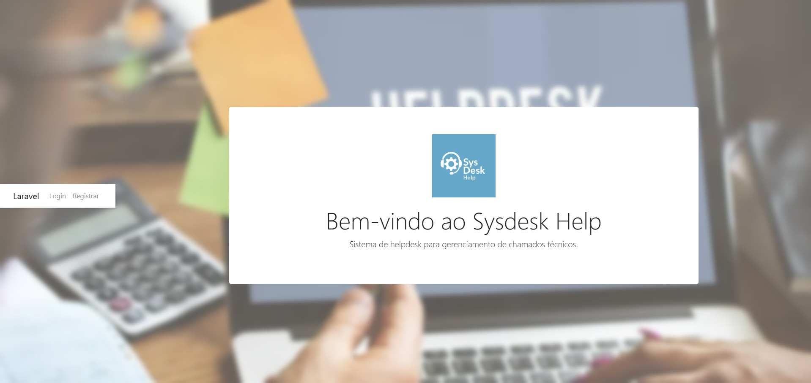

    

    
    
    
    

# Sysdesk Help

**Sysdesk Help** é um sistema de **helpdesk** desenvolvido com o framework **Laravel**, projetado para facilitar o gerenciamento de chamados técnicos de forma simples e eficiente.

## Funcionalidades Implementadas

- ✅ Template base responsivo com Bootstrap
- ✅ Autenticação de login
- ✅ Grupo de usuários (controle de acesso)
- ✅ Criação e gerenciamento de **Departamentos**
- ✅ Criação e gerenciamento de **Categorias** de tickets
- ✅ Definição de **Status** de tickets
- ✅ Criação e gerenciamento de **Prioridades** de tickets
- ✅ Sistema de **Tickets**, com criação, atribuição e acompanhamento

## Captura de Tela

    

## Sobre o Laravel

Laravel é um framework para aplicações web com uma sintaxe elegante e expressiva. Ele proporciona uma base sólida para o desenvolvimento moderno com recursos como roteamento, ORM Eloquent, autenticação, entre outros.
