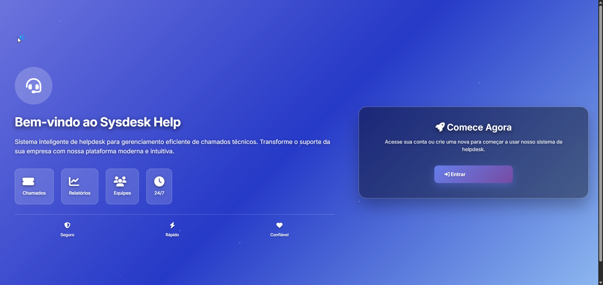

<p align="center">
    <a href="https://laravel.com" target="_blank">
        
    </a>
</p>

<p align="center">
    <a href="https://github.com/laravel/framework/actions">
        
    </a>
    <a href="https://packagist.org/packages/laravel/framework">
        
    </a>
    <a href="https://packagist.org/packages/laravel/framework">
        
    </a>
    <a href="https://packagist.org/packages/laravel/framework">
        
    </a>
</p>

# Sysdesk Help

**Sysdesk Help** é um sistema de **chamados técnicos (Helpdesk)** desenvolvido com o framework **Laravel**. O objetivo é permitir o gerenciamento completo de tickets, departamentos, interações e relatórios, com foco em produtividade e organização da equipe de suporte.

---

## ✅ Funcionalidades

- 🔐 Autenticação de usuários com verificação de e-mail
- 👤 Edição de perfil do usuário
- 👥 Controle de permissões via **Grupos de Usuários**
- 🏢 Gerenciamento de **Departamentos** e **Categorias**
- 🚦 Definição de **Status** e **Prioridades** para tickets
- 🎫 CRUD completo de **Tickets** (Chamados)
- 💬 **Interações de Tickets** com histórico e **anexos múltiplos**
- 📝 Cadastro de **Tipos de Interação**
- 🧠 **Notificações por e-mail** ou in-app sobre atualizações de tickets/interações
- 📄 **Relatórios em PDF** para controle de chamados
- 📱 Interface responsiva com **Bootstrap 5**

---

## 📂 Menus do Sistema

- 🏠 **Dashboard**
- 👤 **Meu Perfil**
- 👨‍💻 **Usuários**
- 🛡️ **Grupos de Usuários**
- 🏢 **Departamentos**
- 🗂️ **Categorias**
- 🚦 **Status dos Tickets**
- ⚡ **Prioridades dos Tickets**
- 🎫 **Tickets**
- 💬 **Interações dos Tickets**
- 📝 **Tipos de Interação**
- 📊 **Relatórios**

---

## 🔮 Possíveis Melhorias Futuras

- 🔐 Controle de permissões avançado por função e política (RBAC completo)
- 📦 Gestão de Serviços por Categoria para controle de escopo e SLA
- 📊 Relatórios analíticos interativos com gráficos de desempenho
- ⏳ Sistema de SLA com alertas e controle de tempo de resposta e resolução
- 📅 Agenda de atendimento com calendário de chamados
- 🔁 Atribuição automática de tickets com base em carga ou regras
- 💬 Chat interno ou chatbot para abertura e acompanhamento de chamados
- 🧾 Histórico de ações completo (log de auditoria)
- 🌐 Suporte a múltiplos idiomas (i18n / l10n)

## 📸 Captura de Tela

<p align="center">
    
</p>

---

## 🔧 Sobre o Laravel

Laravel é um dos frameworks PHP mais poderosos e populares. Ele oferece:

- 🗺️ Roteamento limpo e expressivo
- 🗃️ ORM Eloquent para banco de dados
- 🔑 Sistema robusto de autenticação
- 🖌️ Blade: engine de templates leve e poderosa
- ⚙️ Artisan: comandos CLI para automação
- 🧪 Suporte a testes automatizados

---

## 🚀 Requisitos

- ✅ PHP >= 8.1
- ✅ Composer
- ✅ MySQL
- ✅ Node.js + NPM
- ✅ Extensões PHP: `pdo`, `mbstring`, `openssl`, `tokenizer`, etc.

---

## ▶️ Como Rodar o Projeto Localmente

```bash
# Clonar o projeto
git clone https://github.com/seu-usuario/sysdesk-help.git
cd sysdesk-help

# Instalar dependências PHP
composer install

# Criar e configurar o .env
cp .env.example .env
php artisan key:generate

# Rodar migrações
php artisan migrate

# Instalar dependências do frontend
npm install && npm run dev

# Iniciar servidor
php artisan serve